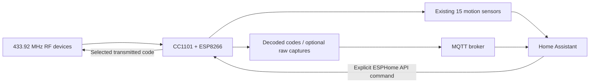
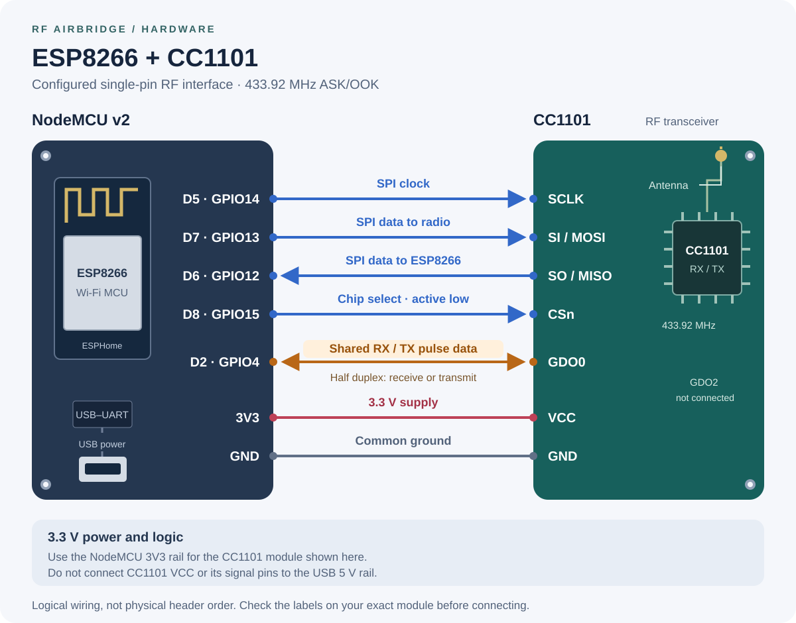

# RF Airbridge

**Learn RF codes in Home Assistant without adding a new ESPHome sensor for every
device, and transmit a selected code from Home Assistant.** RF Airbridge extends
an ESP8266 NodeMCU and CC1101 receiver with an MQTT event stream and a validated
ESPHome transmit action.

The starting configuration already recognized **15 motion sensors** through
hardcoded ESPHome `remote_receiver` binary sensors. This project preserves those
sensors and their existing Home Assistant entities. Alongside them, it publishes
every frame recognized by the stock RCSwitch decoder, including previously
unknown device codes. New matching rules can then live in Home Assistant.

The implementation is specific to **ESPHome 2026.8.2**, **ESP8266**, and the
documented **433.92 MHz ASK/OOK** wiring. The local receiver patch deliberately
rejects other ESPHome versions until it has been rebased and tested.

## What it adds

- **Decoded RF events:** `rf/received` contains protocol, exact binary code,
  bit length, and observation metadata. Leading zeroes are preserved.
- **Optional raw learning:** an off-by-default diagnostic switch exposes bounded
  captures that the RCSwitch decoder could not recognize.
- **A Home Assistant example:** match one exact code and increment a counter,
  with repeat suppression. No physical load is operated by the receive example.
- **Transmit actions:** send a chosen RCSwitch code or a Dooya command through
  Home Assistant's ESPHome integration, with firmware input validation and a
  shared busy/cooldown guard.
- **Reception restored after transmission:** a small, version-pinned receiver
  patch reattaches the ESP8266 capture interrupt without reallocating its buffer.

## How the pieces fit



MQTT carries observations. The authenticated native ESPHome API carries transmit
requests. No MQTT receive message is automatically retransmitted, and this
project does not subscribe to an MQTT transmit-command topic.

The CC1101 is half duplex: reception pauses during a transmission, then resumes.
The existing motion sensors and the MQTT stream share the same receiver. They
do not require a second radio or a second capture pin.

## Hardware and starting configuration



The connected module is a **CC1101 RF transceiver**; the motion sensors send
their codes to it wirelessly. The diagram shows the configured signal
connections, not the physical order of either board's header pins.

**Bluetooth needs separate hardware.** This ESP8266/CC1101 node has no Bluetooth
radio. The [Bluetooth companion guide](docs/bluetooth.md) explains how to use an
existing Home Assistant proxy, privately capture an unknown light remote, and
distinguish receive support from the ability to control a BLE lamp. A bounded
[capture tool](tools/capture_bluetooth.py) is included; support for a particular
lamp must be established by real receive and transmit tests.

The example uses `nodemcuv2` and these connections:

- CC1101 SPI clock → ESP8266 GPIO14.
- CC1101 MOSI → GPIO13; MISO → GPIO12.
- CC1101 chip select → GPIO15.
- CC1101 GDO0 → GPIO4, also labeled D2 on the NodeMCU.
- Appropriate module power and a common ground, following the module's ratings.

The illustration uses the NodeMCU **3V3** rail for a 3.3 V CC1101 module.
Do not connect the CC1101's supply or signal pins to USB 5 V. Check the exact
module's markings and power requirements; see the
[TI CC1101 datasheet](https://www.ti.com/lit/ds/symlink/cc1101.pdf).

GDO0 is the shared receive/transmit data wire. Confirm the physical connection
before enabling transmission; a configuration comment alone cannot prove the
wiring. Keep an antenna suitable for the module and frequency connected.

The preserved receive settings are 30% tolerance, a 250 µs filter, and a 4 ms
idle threshold. They were chosen for the existing sensors, not as universal
settings for every 433 MHz device. See [receive limits](docs/rx-mqtt.md#unknown-raw-frames)
before changing them.

## Install or migrate

1. **Back up the working configuration and firmware.** Keep a private copy of
   the original device YAML, secrets, and known-working firmware binary. Preserve
   the original node name, API encryption key, OTA password, and sensor names
   when migrating an existing node.
2. Clone [ha-homelab/rf-airbridge](https://github.com/ha-homelab/rf-airbridge).
   Keep the directory structure intact: the package uses local headers and a
   local external component.
3. Copy [device.example.yaml](device.example.yaml) to a private `device.yaml`,
   or merge the package into your existing device configuration. Keep the
   existing `binary_sensor:` definitions rather than copying any private sensor
   codes into the public example.
4. Supply private `secrets.yaml` entries for `wifi_ssid`, `wifi_password`,
   `api_encryption_key`, `ota_password`, `mqtt_broker`, `mqtt_username`, and
   `mqtt_password`. Home Assistant and the node must use the same MQTT broker.
5. Build with **exactly ESPHome 2026.8.2**. Review the resolved configuration and
   compile before uploading to the intended device.

One local build environment is:

```sh
git clone https://github.com/ha-homelab/rf-airbridge.git
cd rf-airbridge
python3.12 -m venv .venv
.venv/bin/python -m pip install "esphome==2026.8.2"
```

After preparing `device.yaml` and `secrets.yaml`:

```sh
.venv/bin/esphome config device.yaml
.venv/bin/esphome compile device.yaml
```

Upload through your ESPHome dashboard, or select the node explicitly:

```sh
RF_NODE_ADDRESS=rf.local
.venv/bin/esphome upload device.yaml --device "$RF_NODE_ADDRESS"
```

Use the actual address of the intended node if it has another name. A successful
compile is not confirmation that firmware was uploaded or that RF reception
works.

The main package is [packages/rf-airbridge.yaml](packages/rf-airbridge.yaml).
When merging into an existing configuration, avoid defining the same receiver,
CC1101, or IDs twice. The package supplies the radio and receive/transmit wiring;
the device file supplies Wi-Fi, API encryption, OTA, MQTT credentials, SPI, and
the legacy sensor definitions. `rf_airbridge_path` locates the local headers and
component when the main YAML lives elsewhere. Other substitutions select the
source identifier and MQTT topics.

Keep credentials, real learned codes, local addresses, captures, and compiled
firmware private. Do not commit the populated device or secrets files.

## Learn a code and use it in Home Assistant

Listen to `rf/received` in Home Assistant's MQTT integration and operate one of
your RF devices. A synthetic example looks like this:

```json
{
  "schema": 1,
  "source": "rf",
  "origin": "radio",
  "format": "rc_switch",
  "frequency_mhz": 433.92,
  "boot_id": "0123456789abcdef",
  "sequence": 1,
  "event_id": "rf:0123456789abcdef:1",
  "uptime_ms": 12345,
  "protocol": 1,
  "bits": 24,
  "code": "000000010010001101000101",
  "value": "74565"
}
```

The code is a string, not a number. Both its leading zeroes and its bit count
matter. The decimal `value` is also a string to avoid rounding 64-bit values.
`event_id` identifies an observation, not a device. A remote that repeats its
frame produces several observations with the same code and different event IDs.

Install [examples/home-assistant.yaml](examples/home-assistant.yaml) as a Home
Assistant package. It creates `counter.rf_received_example`, an exact-match
receive automation, and `script.rf_send_code`. The receive automation checks
the source, origin, format, protocol, bit count, and binary string. A matching
frame increments the counter and starts a 750 ms interval during which further
matches are ignored.

Replace the synthetic code in your **private copy** with one consistently
observed from your device. You can add further automations using different
codes without rebuilding ESPHome. Once the counter demonstrates the correct
match, substitute the action appropriate for that device.

[Home Assistant setup and worked tests](docs/home-assistant.md) explains package
installation, malformed-message handling, and testing the receive automation
with a synthetic MQTT message. That test proves MQTT → Home Assistant; a real
RF observation separately proves radio → MQTT.

For an unrecognized device, temporarily enable **Raw RF learning** and listen to
`rf/received/raw`. Captures are limited to 256 pulses and one publication attempt
per 500 ms. Oversized captures are rejected, not truncated. This is **raw
learning only**: arbitrary raw-waveform transmission is not implemented.

See [the receive schema and implementation](docs/rx-mqtt.md) for complete field
definitions, limits, and why the helper uses `on_raw` to retain the bit length
that ESPHome's `on_rc_switch` payload omits.

## Transmit a selected code

In Home Assistant's **Developer tools → Actions**, select `script.rf_send_code`.
Enter a code you intend to transmit, its protocol, and a repeat count. The
script calls `esphome.rf_send_rf_code`; a different node name produces a
different action prefix.

Both the HA script and firmware validate requests before sending:

- `code`: a string containing **8–64 binary digits**, preserving leading zeroes.
- `protocol`: **1–8**, matching the captured RCSwitch protocol number.
- `repeats`: **1–10**; the HA script defaults to 3.

No transmission occurs simply by installing the package. Calling the action
transmits over the air and may operate a matching receiver, so select a known
code for the device you want to control. The synthetic receive example is not
a commissioning transmit command.

The firmware serializes requests and reports `invalid_request`, `busy`, or
`send_finished` on `rf/transmit/result`. A finished send restores reception and
sets `delivery_confirmed: false`: it records software completion, not an
acknowledgement from the target appliance. Observe the intended device when
verifying a real command.

The [receiver interrupt patch](docs/tx-receiver-patch.md) explains why changing
the shared pin back to input is insufficient in ESPHome 2026.8.2, and how
`suspend()`/`resume()` restore capture without repeatedly running `setup()`.

For Dooya's 40-bit command format, use `esphome.rf_send_dooya_code` with
`remote_id`, `channel`, `button`, `check`, and `repeats`. It uses ESPHome's
native Dooya encoder and the same guarded worker as RCSwitch, including its
750 ms cooldown. The [Dooya guide](docs/dooya-transmission.md) describes the
field bounds and provides a synthetic example that powers a receiver, waits
three seconds, and sends the selected command. This adds transmission; the
existing MQTT receive decoder and timing remain unchanged.

## Scope and limitations

“All codes” means all successfully decoded **stock RCSwitch** frames received
under this radio configuration while MQTT is connected. It does not mean every
signal in the air. The first matching decoder wins. Pulse filtering, radio
range, interference, receiver framing, and paused reception during transmission
can affect what is observed.

The event topics use QoS 0 and no retain. There is no persistent event history,
offline queue, or guaranteed delivery. Per-device debouncing belongs in the HA
automation; the bridge does not merge decoded repeats. The payload's `origin`
is descriptive metadata, not authentication of the RF sender or MQTT publisher.

Other frequencies, FSK protocols, encrypted or rolling-code devices, and arbitrary
raw transmission are outside the implemented scope. Capturing a pulse train
does not by itself make a device controllable. Never connect the receive topic
directly to the transmit action: that can create a feedback loop.

## Tests and verification

Host tests require Python 3.12 and a C++17 compiler:

```sh
python3.12 -m venv .venv-test
.venv-test/bin/python -m pip install -r requirements-test.txt
.venv-test/bin/python -m unittest discover -s tests -v
```

The host tests exercise event serialization and bounds, exact HA matching and
input validation, and the actual patched receiver source against GPIO/clock
test doubles. The receiver patch test checks interrupt restoration, removal of
a partial capture, and repeated cycles without extra allocation.

To validate the public example without creating real credentials, use
[tools/validate_firmware.py](tools/validate_firmware.py) in the pinned ESPHome
environment created above:

```sh
.venv/bin/python tools/validate_firmware.py --config-only
.venv/bin/python tools/validate_firmware.py
```

The first command validates the configuration; the second compiles the example.
The tool creates an isolated temporary copy with dummy credentials and removes
it on exit. It does not upload firmware or contact an RF node. A cold build
downloads the required toolchain and can take several minutes.

The [CI workflow](.github/workflows/tests.yml) runs the host tests and a separate
example-firmware build using `ghcr.io/esphome/esphome:2026.8.2`, with read-only
repository permissions and no device credentials.

The original ESP8266/CC1101 node has now been upgraded by OTA to ESPHome
2026.8.2, reconnected to Home Assistant, and published real radio events over
MQTT. All 15 existing motion sensor definitions were preserved. A 180-second
observation recorded 233 decoded events across 11 distinct protocol/code pairs,
including 24 frames absent from the configured sensor-code set. All 233 event
IDs were unique and none of those events was retained. Brief raw learning
produced two raw-frame events and was then disabled again.

See [live validation on 2026-10-06](docs/live-validation.md) for observed evidence
and its limits. The HA counter consumed a synthetic matching MQTT event; the
natural RF capture was checked separately. The transmit script's package-merge
selector issue was fixed and checked on the installed HA configuration. Invalid
requests were rejected, and a valid send completed with the receiver restored.
A separate 120-second transmit-validation capture recorded 198 natural RF
frames before the send and 198 after it, with the same boot ID and no reboot.

Delivery to an independent RF appliance was **not tested**. Software transmit
completion and receiver recovery must not be treated as proof that a target
appliance received or acted on the signal. Host tests, firmware compilation,
and live hardware checks establish different things.

To roll back, restore the private known-working configuration and firmware.
Remove the new HA example package if desired, then reload the affected domains
or restart Home Assistant. Preserve the original sensor definitions and
credentials so existing integrations can reconnect.

## License and third-party code

Original RF Airbridge integration code, configuration examples, tests, and
documentation are under the [MIT license](LICENSE), except where a file carries
another notice. The vendored `components/remote_receiver` directory retains
ESPHome's licensing: **C++ runtime files are GPLv3; Python files are MIT**. The
local runtime modifications remain GPLv3. See the retained
[upstream license](components/remote_receiver/LICENSE) and
[provenance record](components/remote_receiver/PROVENANCE.md).

The root MIT license does not relicense the ESPHome runtime or make the combined
firmware MIT-only. Distributing firmware that includes the GPLv3 runtime requires
compliance with GPLv3, including the applicable corresponding-source obligations.
